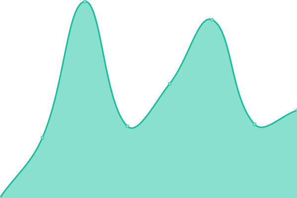
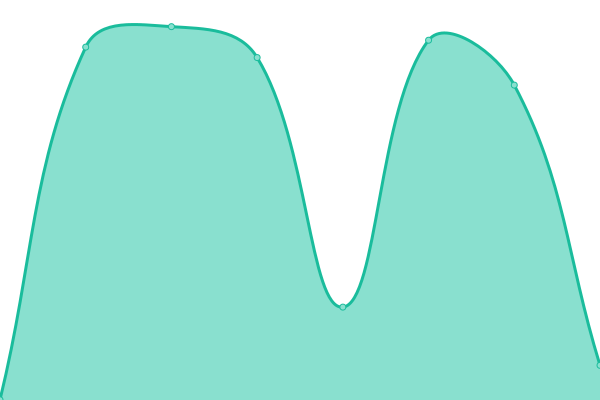
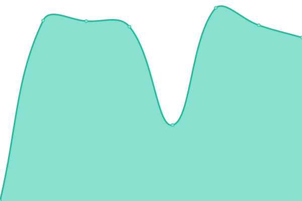
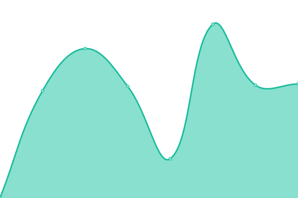

# [📈 Live Status](https://$LIQUIBASE_IO_CNAME): <!--live status--> **🟩 All systems operational**

This repository contains the open-source uptime monitor and status page for [Liquibase](https://www.liquibase.org), powered by [Upptime](https://github.com/upptime/upptime).

With [Upptime](https://upptime.js.org), you can get your own unlimited and free uptime monitor and status page, powered entirely by a GitHub repository. We use [Issues](https://github.com/liquibase/liquibase-io-status/issues) as incident reports, [Actions](https://github.com/liquibase/liquibase-io-status/actions) as uptime monitors, and [Pages](https://$LIQUIBASE_IO_CNAME) for the status page.

<!--start: status pages-->
<!-- This summary is generated by Upptime (https://github.com/upptime/upptime) -->
<!-- Do not edit this manually, your changes will be overwritten -->
<!-- prettier-ignore -->
| URL | Status | History | Response Time | Uptime |
| --- | ------ | ------- | ------------- | ------ |
|  Liquibase.io API | 🟩 Up | [liquibase-io-api.yml](https://github.com/liquibase/liquibase-io-status/commits/HEAD/history/liquibase-io-api.yml) | 

 1800ms
     
 | 

<a href="https://status.liquibase.io/history/liquibase-io-api">98.50%</a>
    

|  Liquibase.io WEB | 🟩 Up | [liquibase-io-web.yml](https://github.com/liquibase/liquibase-io-status/commits/HEAD/history/liquibase-io-web.yml) | 

 1201ms
     
 | 

<a href="https://status.liquibase.io/history/liquibase-io-web">98.63%</a>
    

|  Liquibase.io Runner | 🟩 Up | [liquibase-io-runner.yml](https://github.com/liquibase/liquibase-io-status/commits/HEAD/history/liquibase-io-runner.yml) | 

 926ms
     
 | 

<a href="https://status.liquibase.io/history/liquibase-io-runner">100.00%</a>
    

|  Liquibase.io Dispatcher | 🟩 Up | [liquibase-io-dispatcher.yml](https://github.com/liquibase/liquibase-io-status/commits/HEAD/history/liquibase-io-dispatcher.yml) | 

 961ms
     
 | 

<a href="https://status.liquibase.io/history/liquibase-io-dispatcher">100.00%</a>
    

|  Liquibase.io Connection Tester | 🟩 Up | [liquibase-io-connection-tester.yml](https://github.com/liquibase/liquibase-io-status/commits/HEAD/history/liquibase-io-connection-tester.yml) | 

 927ms
     
 | 

<a href="https://status.liquibase.io/history/liquibase-io-connection-tester">100.00%</a>
    

<!--end: status pages-->

[**Visit our status website →**](https://$LIQUIBASE_IO_CNAME)

## 📄 License

- Powered by: [Upptime](https://github.com/upptime/upptime)
- Code: [MIT](./LICENSE) © [Anand Chowdhary](https://anandchowdhary.com), supported by [Pabio](https://pabio.com)
- Data in the `./history` directory: [Open Database License](https://opendatacommons.org/licenses/odbl/1-0/)
